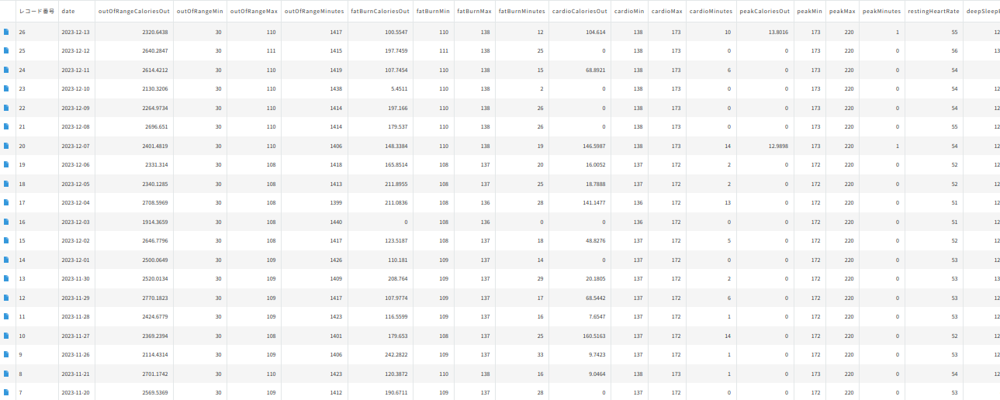

# MyDailyRecord

このプロジェクトは、Fitbit で取得したデータを kintone 上に記録するためのアプリケーションです。
AWS Lambda で動作させています。
それぞれのアプリケーションは独自のディレクトリ（fitbit と kintone）に配置されています。

# DEMO



# Features

Fitbit の取得データを JSON で取得するために取りうるデータのほとんどを型定義しました。
同様の処理をしたい場合にはあ参考になると思われます。

# Requirement

Go の環境を用意してください

Go : 1.20.4 linux/amd64
aws-lambda-go : v1.41.0

# Usage

使用する場合はバイナリを作成して Lambda 関数に登録してください。
バイナリの作成方法は makezip を参照してください。

kintone, fitbit 両方をライブラリ化しているため、独立して使用することが可能です。

# Note

環境変数はローカルでは下記のように設定してください。

- kintone ディレクトリに conf.json を用意

```json
{
  "api_token": "{発行したAPIトークン}",
  "subdomain": "{サブドメイン}",
  "api_id": "{アプリのid}"
}
```

- fitbit ディレクトリに conf.json を用意

```json
{
  "access_token": "{発行したトークン}",
  "refresh_token": "{トークンの再取得に使うトークン}",
  "client_id": "{ClientId}"
}
```

# License

This is under [MIT license](https://en.wikipedia.org/wiki/MIT_License).
